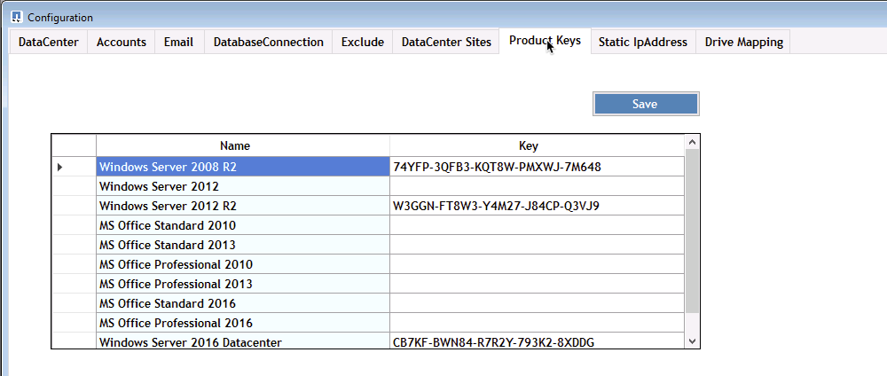

= Panoramica
:allow-uri-read: 

== Panoramica

DCConfig è un'utility di configurazione della macchina virtuale CWMGER1 utilizzata per impostare e modificare molte impostazioni a livello di implementazione.

. Connettersi alla macchina virtuale CWMGER1 come amministratore
. Eseguire l'applicazione dal collegamento sul desktop

All'interno dell'applicazione sono presenti tre sezioni principali: Configurazione, Avanzate e Guida.

=== Configurazioni

La finestra configurazioni si apre al momento dell'avvio e presenta diverse sottosezioni

==== Data center

image::images/Management.dcconfig.dcconfig.overview-61c8f.png[Management.dcconfig.dcconfig.Overview 61c8f]

==== Account

image::images/Management.dcconfig.dcconfig.overview-f34a2.png[Management.dcconfig.dcconfig.Overview f34a2]

==== E-mail

image::images/Management.dcconfig.dcconfig.overview-4b3be.png[Management.dcconfig.dcconfig.Overview 4b3be]

==== DatabaseConnection

image::images/Management.dcconfig.dcconfig.overview-80da7.png[Management.dcconfig.dcconfig.Overview 80da7]

==== Escludi

image::images/Management.dcconfig.dcconfig.overview-0f30e.png[Management.dcconfig.dcconfig.Overview 0f30e]

==== Siti del data center

image::images/Management.dcconfig.dcconfig.overview-95b21.png[Management.dcconfig.dcconfig.Overview 95b21]

==== Codici "Product Key"

==== Indirizzo IP statico

image::images/Management.dcconfig.dcconfig.overview-7e4a4.png[Management.dcconfig.dcconfig.Overview 7e4a4]

==== Mappatura dei dischi

image::images/Management.dcconfig.dcconfig.overview-60fd2.png[Management.dcconfig.dcconfig.Overview 60fd2]

=== Avanzato

La finestra Advanced (Avanzate) visualizza un elenco di valori modificabili dall'interno di questa interfaccia.

[cols="33,33,33"]
|===
| Nome gruppo | Nome dell'utente | Valore 

| Nome gruppo | Nome dell'utente | Valore 

| Creazione del server | UpdateVMNameWhenRemovedFromCache | Vero/Falso 

| Creazione del server | UpdateFirewallRules | Vero/Falso 

| Creazione del server | WaitAfterRebootMin | n. minuti> 

| Creazione del server | WaitAfterHypervisorCreateMin | n. minuti> 

| Creazione del server | WaitAfterSysPrepMin | n. minuti> 

| Creazione del server | WaitAfterSysPrepFor2008ServerMin | n. minuti> 

| Creazione del server | Percorso agente GFI |  

| Creazione del server | Cloning automatizzato abilitato | Vero/Falso 

| Creazione del server | CompaniOU | <String - Companines OU Name> 

| Creazione del server | Installare ThinPrint v11 | Vero/Falso 

| Creazione del server | ServerOU | <String - Servers OU Name> 

| Creazione del server | Installare FsLogix | Vero/Falso 

| Creazione del server | USA OU predefinite | Vero/Falso 

| Creazione del server | Numero massimo di thread | N. <> 

| Creazione del server | Attendere che il DNS aggiservizio minuti | n. minuti> 

| Controllare la versione degli strumenti Vdc | Eseguire ogni X minuti | n. minuti> 

| Azioni giornaliere | Attivato | Vero/Falso 

| Azioni giornaliere | Esegui all'avvio | Vero/Falso 

| Generare report | Ora del giorno | <TIME 00:00> 

| Manutenzione giornaliera | Attivato | Vero/Falso 

| Manutenzione giornaliera | Ora del giorno | <TIME 00:00> 

| Manutenzione settimanale | Attivato | Vero/Falso 

| Manutenzione settimanale | Ora del giorno | <TIME 00:00> 

| Manutenzione settimanale | Giorno | <day of the week> 

| AutomaticResourceAllocation | Attivato | Vero/Falso 

| Allocazione delle risorse | USA le impostazioni predefinite del data center | Vero/Falso 

| EmailReports | IncludeEmailAttachment | Vero/Falso 

| Heartbeat del server | Minuti di intervallo | n. minuti> 

| Scarica AutoPro Data | Minuti di intervallo | n. minuti> 

| Heartbeat del data center | Minuti di intervallo | n. minuti> 

| Il server si riavvia | Attivato | Vero/Falso 

| Il server si riavvia | Ritardo tra i minuti di riavvio | n. minuti> 

| FreeSpaceReport | MinFreeSpaceGB | Soglia minima n. GB> 

| MaxRebootTimeSpanHours | ClientServer | n. di ore prima del riavvio richiesto> 

| MaxRebootTimeSpanHours | Server infrastruttura | n. di ore prima del riavvio richiesto> 

| Aggiorna automaticamente gli strumenti VDC | Attivato | Vero/Falso 

| ActivateOffice | Attivato | Vero/Falso 

| ActivateWindows | Attivato | Vero/Falso 

| Monitoraggio | Giorni massimi di conservazione | n. giorni> 

| Registri | Giorni massimi di conservazione | n. giorni> 

| Report Data (dati report) | Giorni massimi di conservazione | n. giorni> 

| Audit del file | Giorni massimi di conservazione | n. giorni> 

| Audit del file | Registrazione dettagliata | Vero/Falso 

| FileAuditFolders | NumFolder | 2 

| FileAuditFolder1 | Percorso | [DataDrive]:/dati 

| FileAuditFolder1 | Escludi | *Thumbs.db 

| FileAuditFolder1 | Escludi | *.tmp 

| FileAuditFolder1 | Escludi | *~*.doc 

| FileAuditFolder1 | Escludi | *~*.docx 

| FileAuditFolder2 | Percorso | [DataDrive]: Pagina iniziale 

| FileAuditFolder2 | Escludi | Thumbs.db 

| CwVmAutomationService | Argomenti della riga di comando del servizio |  

| FtpReleaaeAddress | URL | <ftp URL> 

| Pianificazione del carico di lavoro | Eseguire ogni X minuti | n. minuti> 

| Pianificazione del carico di lavoro | Disattivare le società cache | Vero/Falso 

| Creare backup | Attivato | Vero/Falso 

| Creare backup | Eseguire ogni X minuti | n. minuti> 

| Monitorare le applicazioni | Attivato | Vero/Falso 

| PENNA | InitialSleepSeconds | n. secondi> 

| PENNA | MustChangePasswordDay | < n. giorni prima della scadenza per il reset PW forzato> 

|  |  | <Password reset text string> 

| PENNA | Logo | <local .png logo path> 

| PENNA | NumNotifyDays | n. giorni> 

| PENNA | NotificationDay1 | < n. giorni prima della scadenza per la notifica> 

| PENNA | NotificationDay2 | < n. giorni prima della scadenza per la notifica> 

| PENNA | NotificazioneDay3 | < n. giorni prima della scadenza per la notifica> 

| PENNA | NotificazioneDay4 | < n. giorni prima della scadenza per la notifica> 

| PENNA | NotificationDay5 | < n. giorni prima della scadenza per la notifica> 

| PENNA | NotificationDay6 | < n. giorni prima della scadenza per la notifica> 

| Monitoraggio | Attivato | Vero/Falso 

| Monitoraggio | Invia avvisi e-mail | Vero/Falso 

| Monitoraggio | Server di avviso inattivo per minuti | n. minuti> 

| Monitoraggio | Alert RAM High per minuti | n. minuti> 

| Monitoraggio | RAM High % | <RAM % Threshold> 

| Monitoraggio | CPU di avviso alta per minuti | n. minuti> 

| Monitoraggio | CPU High % | <CPU % Threshold> 

| Monitoraggio | Percentuale di spazio su disco insufficiente | <Disk Space Free % Threshold> 

| Delete Client Delay (Elimina ritardo client | Minuti | n. minuti> 

| Espandi automaticamente disco | Attivato | Vero/Falso 

| Protezione avanzata | Attivato | Vero/Falso 

| Eseguire CwAgent come Domain Admin | Attivato | Vero/Falso 

| Monitorare i server | Utilizzo di SolarWinds | Vero/Falso 

| Aggiorna automaticamente il portale H5 | Attivato | Vero/Falso 

| Installare il carattere jolly Cert | Sui server dell'infrastruttura | Vero/Falso 

| Creazione dell'azienda | In un sito unico | Vero/Falso 

| Scalabilità in tempo reale | Ritardo spegnimento min | n. minuti> 

| Report delle risorse del server | Controllare il DNS | Vero/Falso 

| Hypervisor | Modelli di cache | Vero/Falso 

| Registrazione dettagliata | Scalabilità in tempo reale | Vero/Falso 

| Registrazione dettagliata | Scalabilità in tempo reale: Mostra lo stato del server | Vero/Falso 

| Registrazione dettagliata | Workload Scheduling | Vero/Falso 

| Registrazione dettagliata | Crea server da modello | Vero/Falso 

| Registrazione dettagliata | Crea server da Template Timing | Vero/Falso 

| Registrazione dettagliata | Crea server da backup | Vero/Falso 

| Registrazione dettagliata | Crea server da Clone | Vero/Falso 

| Registrazione dettagliata | Crea modello | Vero/Falso 

| Registrazione dettagliata | Comunicare con altri servizi | Vero/Falso 

| Crea modello | Eseguire manualmente SysPrep | Vero/Falso 

| Controller di dominio | Nome | cwmgr1.<domain.com> 
|===
image::images/Management.dcconfig.dcconfig.overview-9c7ac.png[Management.dcconfig.dcconfig.Overview 9c7ac]

=== Aiuto

Apre il file della guida locale.
